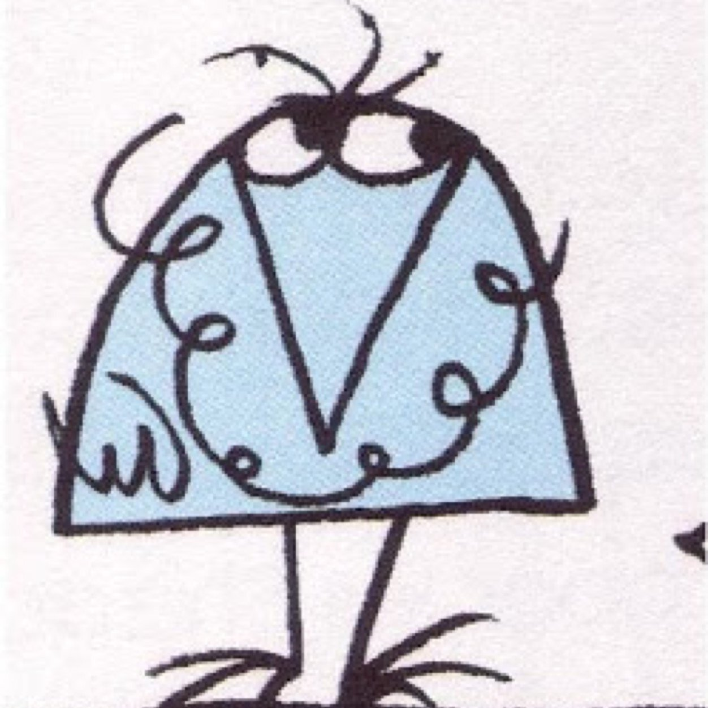

Une introduction au **TODO**.  

Il est consultable librement sur **TODO**

[Les sources des supports sont disponibles sur github](https://github.com/erixtekila/bootstrap_workflow).

> **Note** Ces supports de cours sont évidemment le reflet du travail d'autres auteurs : développeurs, bloggeurs, auteurs de tous poils. Le contenu est original au même titre qu'un remix, mais pas unique. Qu'elle prétention (!). Remercions l'ensemble des contributeurs du monde, les shadoks et autres licornes.

_Les contributions sont toutefois bien accueillies._

 Ce(tte) œuvre est mise à disposition selon les termes de la <a rel="license" href="http://creativecommons.org/licenses/by-nc-sa/4.0/">Licence Creative Commons Attribution - Pas d’Utilisation Commerciale - Partage dans les Mêmes Conditions 4.0 International</a>.
